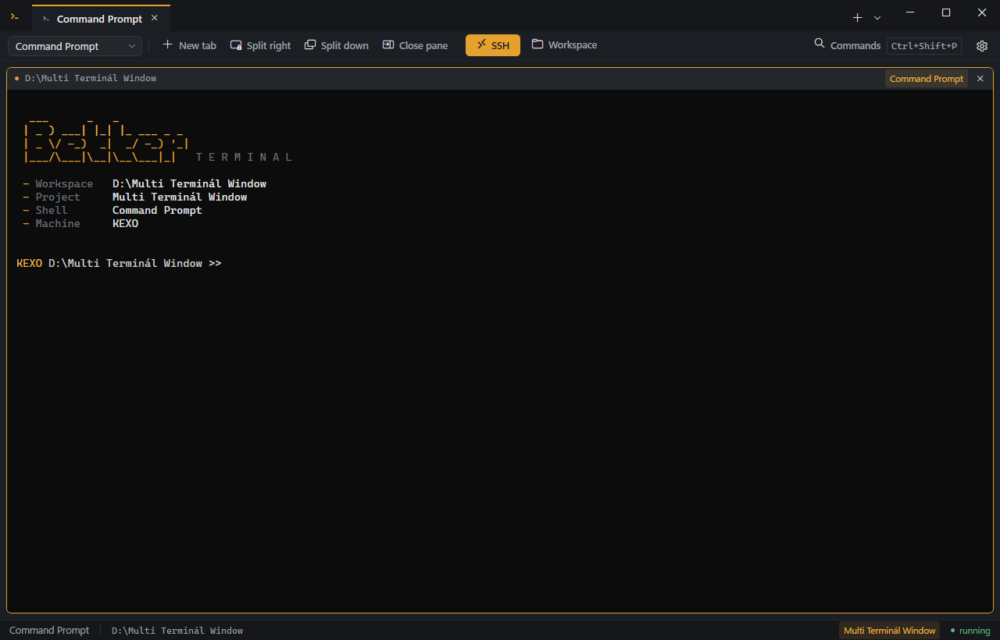

# BetterTerminal

A Windows terminal that opens on the folder you are working in.

| | |
| --- | --- |
| **Version** | 1.4.0 · BETA |
| **Download** | [`BetterTerminal.exe`](../../releases/latest) - one file, nothing to unpack |
| **Runs on** | 64-bit Windows 10 / 11 with .NET Framework 4.8 |
| **Built with** | .NET Framework 4.8 · WPF · direct Win32 interop |
| **Dependencies** | none - **zero NuGet packages**, builds offline with MSBuild alone |
| **Licence** | [MIT](LICENSE) |

Type `beterm` at any command prompt and BetterTerminal opens there, treats that folder as a project,
and remembers what you set up for it. Command Prompt and Windows PowerShell run in tabs and splits
in one window, with your own commands, your saved remote connections and your layout kept between
runs.



## Special thanks

| Contributor | For |
| --- | --- |
| **[Deerpfy](https://github.com/Deerpfy)** | The `ai.bat` launcher the CLI-AI Wizard is ported from - the guided flow that builds a command line for Claude, Codex, Gemini or Antigravity. |

## Install

1. Download `BetterTerminal.exe` from the [latest release](../../releases/latest).
2. Run it.

That one file carries the whole application: it unpacks itself into a private temporary folder,
runs, and clears the folder away when you close it. There is nothing to unpack by hand and nothing
left lying around.

The first run also copies the application to `%LOCALAPPDATA%\BetterTerminal\app` and registers the
`beterm` command - no installer, no administrator rights for that part. That copy is what `beterm`
starts, so it keeps working after the temporary folder is gone. Open a **new** prompt afterwards,
because a prompt only reads the search path when it starts.

**Windows will ask for administrator rights once.** The first run registers the *BetterTerminal
Host* service, and a service lives in the machine's service database rather than in your profile.
That is the only thing here that leaves your user profile and the only prompt you will see. It is
asked **once**: refuse it and the application runs perfectly well without the service and never asks
again. To change your mind later, run `beterm-service.exe --install` (or `--uninstall`) from an
elevated prompt in `%LOCALAPPDATA%\BetterTerminal\app`.

Running a newer `BetterTerminal.exe` replaces that copy with the newer version by itself; an older
one leaves a newer copy alone.

To remove it: run `beterm-service.exe --uninstall` from an elevated prompt first - deleting the
folders leaves the service registered - then delete `%LOCALAPPDATA%\BetterTerminal` and
`%APPDATA%\BetterTerminal`.

Needs 64-bit Windows and .NET Framework 4.8, which is already on Windows 10 and 11. Windows 10 build
17763 or newer gets the full terminal; older builds fall back to a hosted console window.

## What you get

| Feature | What it does |
| --- | --- |
| **Folder as a project** | `beterm` opens the application in that folder, with its settings in a hidden `.beterm` folder. |
| **Files** | A folder tree and a viewer for anything in it: code with colours, pictures, and a byte dump for the rest. |
| **Tabs and splits** | Split any pane right or down, as deep as you like. Every pane has its own shell and directory. |
| **Saved connections** | An address book behind the SSH button, with a reachability heart per host. |
| **Command palette** | `Ctrl+Shift+P` for every layout command and the commands you defined for the project. |
| **CLI-AI Wizard** | A guided flow that assembles a command line for Claude, Codex, Gemini or Antigravity. |
| **Layout that survives** | Tabs, splits, ratios, shells, directories, theme, font and window position are restored. |
| **A real terminal** | Truecolour, scrollback, selection, copy and paste, `Ctrl+wheel` zoom, alternate screen buffer. |

**Open a folder as a project.** `beterm` in any folder opens the application there. The folder gets
a hidden `.beterm` folder holding its settings: a name, which shell to use, a line to run when it
opens, commands you define yourself, and any values you want to keep with the project. Your own
commands appear in the command palette and run in the focused session.

**Files.** The Files button opens the folder as a tree beside a viewer, and what a file *is* decides
how it is shown - not what its name claims:

| Kind | How it is shown |
| --- | --- |
| Code and structured text | Coloured by language: C#, C/C++, JavaScript and TypeScript, Java, Go, Rust, PHP, CSS, SQL, Python, PowerShell, shell, batch, **JSON** and **markup** (XML, XAML, HTML, SVG, project files). |
| Plain text | In the encoding it was actually written in - a byte order mark is believed, and a file without one that is not UTF-8 is read in the machine's code page. `Ctrl+S` writes it back the same way, same line endings, no mark added. |
| Pictures | `.png .jpg .gif .bmp .tif .ico .webp .heic .avif` and anything else Windows has a decoder for. |
| Anything else | A dump of its first bytes, in offset, hex and characters. |

A file too large to hold opens read-only instead of being refused, and a name in no known language
gets no colours rather than the wrong ones.

**A session that tells you where you are.** Each pane opens on a short banner naming the workspace,
the project, the shell and the machine, and the prompt reads `MACHINE /project/folder >>`.

**Saved connections.** The SSH button keeps an address book of `user@address` entries, stored per
user rather than per project. Each row shows a heart: filled and green when the host answers on the
standard port, an outline in red when it does not. Pick one and it opens a session with the
connection line already typed, either in the pane grid or in a window of its own.

**Tabs and splits.** Split any pane right or down, as deep as you like, with draggable dividers.
Every pane has its own shell and its own working directory.

**A command palette** on `Ctrl+Shift+P`, holding every layout command and your project's commands.

**Your layout survives a restart.** Tabs, the split tree, ratios, shell choice, working directories,
theme, colour scheme, font and window position are restored the next time you start.

**A real terminal underneath.** Full colour including truecolour, scrollback with selection, copy
and paste, `Ctrl+wheel` zoom, and the alternate screen buffer - so an editor or a pager draws
correctly and leaves your scrollback intact. When a shell exits, the pane says so and gives you the
exit code instead of going blank.

### Keyboard

| Shortcut | Action |
| --- | --- |
| `Ctrl+Shift+T` | New tab |
| `Alt+Shift+Plus` | Split right |
| `Alt+Shift+Minus` | Split down |
| `Ctrl+Shift+W` | Close the focused pane |
| `Alt+Right` / `Alt+Left` | Focus the next / previous pane |
| `Ctrl+Shift+P` | Command palette |
| `Ctrl+comma` | Settings |
| `Ctrl+Shift+C` / `Ctrl+Shift+V` | Copy / paste |
| `Shift+PageUp` / `Shift+PageDown` | Scroll back / forward |
| `Ctrl+wheel` | Font size |
| `Ctrl+S` | Save the open file - in the Files window |

## Also in the box

The download is one executable, and everything below travels inside it. After the first run it all
sits in `%LOCALAPPDATA%\BetterTerminal\app` beside the `beterm` command.

| Program | What it is for |
| --- | --- |
| `beterm-service.exe` | The **BetterTerminal Host** Windows service. The first run registers it, and it starts with the machine from then on. It runs with no window; its whole visible life is its entry in `services.msc` and the lines it writes to the Windows application log. It also accounts for the helper programs staged beside it. |

<details>
<summary>The helper programs it accounts for</summary>

| Program | What it is for |
| --- | --- |
| `beterm-banner.exe` | Writes the banner a session opens on. The shell runs it as its first command. |
| `beterm-aiwizard.exe` | The CLI-AI Wizard, also reachable from the shell picker beside Command Prompt and PowerShell. Ported from Deerpfy's `ai.bat`. |
| `beterm-wrap.exe` | A text interface for the PowerShell scripts in `tools\`: pick one, fill in its parameters, watch its output and see the exit code it really returned. |

The service does not run these itself - each needs a real console and a service has none. What it
provides is a registered, always-on presence that records which of them are staged beside it.

</details>

## Build it yourself

You need Visual Studio 2022 or newer with the .NET desktop workload, or any MSBuild that can build
.NET Framework 4.8 projects. There is no restore step.

```
MSBuild.exe BetterTerminal.sln /t:Rebuild /p:Configuration=Release /p:Platform=x64
```

The application lands in `BetterTerminal.Shell\bin\x64\Release\BetterTerminal.exe`. `x64` is the only
platform the solution defines. A build is expected to finish with **zero errors and zero warnings**;
that is what the [build workflow](.github/workflows/build.yml) enforces on every push.

## How it is put together

| Project | What it is |
| --- | --- |
| `BetterTerminal.Interop` | Every P/Invoke, SafeHandle and Win32 struct. Nothing else in the solution declares one. |
| `BetterTerminal.Terminal` | The session contract, both backends, the escape-sequence parser, the cell grid and the renderer. |
| `BetterTerminal.Shell` | The application: window, tabs, splits, panes, palette, settings, persistence. |
| `BetterTerminal.Wrap` | `beterm-wrap.exe`, the text interface for the verification scripts. |
| `BetterTerminal.Banner` | `beterm-banner.exe`, the session banner. |
| `BetterTerminal.AIWizard` | The wizard's logic as a library: the agents, the menus and the command it composes. No UI. |
| `BetterTerminal.AIWizard.Cli` | `beterm-aiwizard.exe`, the wizard you can open in a pane. |
| `BetterTerminal.Service` | `beterm-service.exe`, the optional Windows service host. |
| `BetterTerminal.Bootstrap` | The one-file launcher, in C++. It carries the whole application and unpacks it to run. |

Deeper documentation lives at the repository root: [STRUCTURE.md](STRUCTURE.md) for the code map,
[WORKFLOWS.md](WORKFLOWS.md) for runnable procedures, [RULES.md](RULES.md) for the constraints the
code is held to, [TIPS.md](TIPS.md) for the traps that cost time once already, and
[MEMORY.md](MEMORY.md) for why things are the way they are.

## Where your data goes

| Path | What is in it |
| --- | --- |
| `%APPDATA%\BetterTerminal\workspace.json` | Tabs, splits, appearance, window position. |
| `%APPDATA%\BetterTerminal\connections.json` | Saved connections - a user name and an address each, **never a password**. |
| `<project>\.beterm\project.json` | That project's settings, commands and values. Plain text you may commit. |
| `%LOCALAPPDATA%\BetterTerminal\` | The installed copy, the helper programs and the `beterm` command. |
| The machine's service database | The **BetterTerminal Host** service, registered on the first run. The one thing outside your profile; `beterm-service.exe --uninstall` removes it. |

The application makes exactly one kind of network call: a connection to port 22 of a host you saved,
to decide whether its heart is green. It sends nothing, reads nothing and stores no result. There is
no telemetry.

## Honest gaps

- **No test project.** Verification is a warning-clean rebuild plus the scripts in `tools\`.
- **Not code signed**, so Windows will warn the first time you run it.
- The code view is built on the framework's own rich text control, because the no-package rule rules
  out an editor library. A colour change is an edit like any other there, so the undo history in the
  Files window holds steps you did not type.
- Full-screen console applications, a DPI change while running and input latency have not been
  checked by hand.
- The relative `/project/folder` prompt works in Windows PowerShell. Command Prompt shows the full
  path instead: its `PROMPT` understands tokens, not expressions, and a prefix that went stale after
  the first `cd` would be worse.

## Licence

MIT. See [LICENSE](LICENSE).
